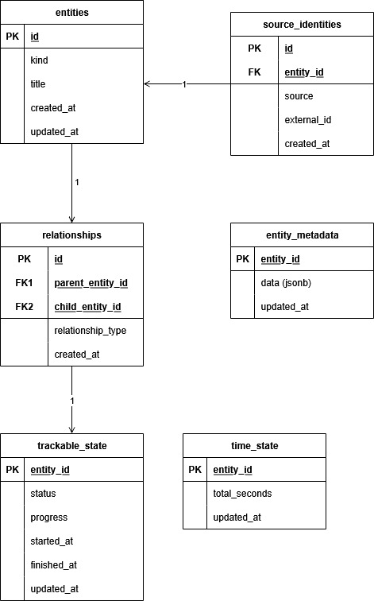

# Media Tracking Domain Documentation

## 1. Overview

This system is designed to track **any personal media** in a uniform, scalable way.
Currently implemented for **games**, but designed to handle:

- Games (and achievements)
- Videos (YouTube, Twitch)
- Movies & Shows (seasons and episodes)
- Music (albums and songs)
- Comics (manga, webcomics, comics, chapters)

Key principles:

1. **Single source of truth per entity** – everything has a canonical `entity`.
2. **External sources are adapters** – never dictate domain structure.
3. **Hierarchies via relationships** – flexible parent → child links.
4. **Capabilities for behavior** – progress, time, achievements.
5. **Metadata is descriptive, not behavioral** – JSON blobs per entity.
6. **Invariants protect correctness** – identity, relationships, state, progress.

---

## 2. Core Tables

### 2.1 `entities`

- **Purpose:** Represent every individual trackable thing.
- **Columns:**

  - `id` (PK, bigint)
  - `kind` (text, e.g., `game`, `episode`, `album`)
  - `title` (text)
  - `created_at`, `updated_at` (timestamps)

- **Invariants:**

  - Every entity has exactly one identity.
  - Every entity has exactly one kind.
  - Every entity has a title.

### 2.2 `source_identities`

- **Purpose:** Map external system IDs to internal entities.
- **Columns:**

  - `id` (PK)
  - `entity_id` (FK → `entities`)
  - `source` (text, e.g., `steam`, `youtube`, `tmdb`)
  - `external_id` (text)
  - `created_at`

- **Invariants:**

  - `(source, external_id)` is unique.
  - One entity can have multiple source identities.
  - Deleting an entity cascades source identities.

### 2.3 `relationships`

- **Purpose:** Represent hierarchies and parent → child links.
- **Columns:**

  - `id` (PK)
  - `parent_entity_id` (FK → `entities`)
  - `child_entity_id` (FK → `entities`)
  - `relationship_type` (text, e.g., `HAS_SEASON`, `HAS_ACHIEVEMENT`)
  - `created_at`

- **Invariants:**

  - No self-links (`parent_entity_id ≠ child_entity_id`).
  - No duplicate edges (`parent_entity_id, child_entity_id, relationship_type` unique).

- **Domain-level invariants:** Only valid kinds participate in a given relationship type.

### 2.4 `entity_metadata`

- **Purpose:** Store descriptive, source-derived fields for each entity.
- **Columns:**

  - `entity_id` (PK, FK → `entities`)
  - `data` (`jsonb`)
  - `updated_at`

- **Notes:**

  - Flexible structure per entity kind.
  - Examples: genres, runtime, platforms, director, release year.
  - Non-behavioral: progress, completion, or time should **not** be here.

### 2.5 `trackable_state`

- **Purpose:** Track user progress / status for trackable entities.
- **Columns:**

  - `entity_id` (PK, FK → `entities`)
  - `status` (text, e.g., `backlog`, `in_progress`, `completed`)
  - `progress` (numeric, optional)
  - `started_at`, `finished_at` (optional dates)
  - `updated_at`

- **Invariants:**

  - Only trackable entities may have this row.
  - `finished_at` ≥ `started_at`.
  - One row per entity.

### 2.6 `time_state`

- **Purpose:** Track accumulated time spent on entities.
- **Columns:**

  - `entity_id` (PK, FK → `entities`)
  - `total_seconds` (bigint, ≥0)
  - `updated_at`

- **Invariants:**

  - One row per entity.
  - Only time-trackable entities may appear here.
  - `total_seconds` ≥ 0.

---

## 3. Capabilities

Capabilities are **composable behaviors** attached to entities:

| Capability   | Applies to                               | What it stores                            |
| ------------ | ---------------------------------------- | ----------------------------------------- |
| Trackable    | Games, Episodes, Videos, Songs, Chapters | status, progress, started_at, finished_at |
| Time-based   | Games, Videos, Music                     | total_seconds, updated_at                 |
| Achievements | Games                                    | unlocked state (entities + state)         |
| Aggregation  | Shows, Albums, Channels, Seasons         | Derived from children, computed on demand |

Containers like Seasons, Shows, Albums **do not track progress or time directly** — they aggregate from children.

---

## 4. Invariants (summary)

- Every entity has a unique identity and kind.
- External `(source, external_id)` points to exactly one entity.
- Relationships cannot be self-referential or duplicated.
- Only valid entity kinds participate in a given relationship type (domain-level).
- Trackable and time state only exist for applicable entity kinds.
- `finished_at` ≥ `started_at`.
- `total_seconds` ≥ 0.

---

## 5. Domain Principles

1. **Sources are adapters:** They emit entities, relationships, and metadata but never dictate structure.
2. **Hierarchies are relationships:** Flexible, composable, and uniform.
3. **Metadata is descriptive:** JSON blobs; never store behavioral data here.
4. **Capabilities model behavior:** Progress, time, achievements are separate from the entity table.
5. **DB enforces structural invariants:** Domain code enforces semantic invariants.
6. **Single vertical slices first:** Start with one source per entity type to validate the model before scaling.

---

## 6. Future considerations

- Multi-user support: add `user_id` to state tables.
- Raw payload caching: optional JSON column in `source_identities`.
- Analytics: session logs, daily summaries, derived metrics.
- Aggregation caches: e.g., show progress %, album completion %.
- Policies for Supabase row-level security (if multi-user).
- Additional capabilities as new media types are added.

---

## 7. Suggested workflow when returning to the project

1. Review the **domain contract** (entities, relationships, capabilities).
2. Check **invariants** to understand why tables are structured this way.
3. Work in **vertical slices**: source → repository → domain → sync → UI.
4. Avoid adding custom per-domain tables unless truly necessary.
5. Keep metadata, trackable_state, and time_state separate from identity and relationships.

---

## 8. Diagram

This diagram shows the core tables and their primary relationships.

- `entities` is the central table.
- `source_identities` maps external systems to entities.
- `relationships` define hierarchical links.
- `entity_metadata` holds descriptive information.
- `trackable_state` and `time_state` are capabilities representing user interaction.
